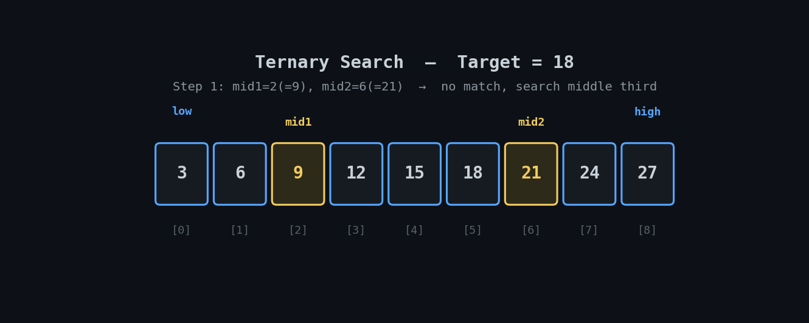

<h1 align="center">🔱 Ternary Search</h1>

<p align="center">
  <i>An animated, beginner-friendly walkthrough of the Ternary Search algorithm with two Python implementations.</i>
</p>

<p align="center">
  
  
  
</p>

---

## 📽️ Visual Walkthrough

Ternary Search splits the current range into **three parts** using two midpoints (`mid1`, `mid2`), checks both, and eliminates two-thirds of the search space each step.

<p align="center">
  
</p>

> 🔵 Blue = active search window · 🟡 Amber = `mid1` / `mid2` being checked · ⚫ Dim = eliminated · 🟢 Green = found

---

## ⚙️ How It Works

1. Set `low = 0` and `high = length - 1`.
2. While `low <= high`, compute two midpoints:
   `mid1 = low + (high - low) // 3`, `mid2 = high - (high - low) // 3`.
3. Match at `mid1` or `mid2` → return that index.
4. `target < arr[mid1]` → search the **first third** (`high = mid1 - 1`).
   `target > arr[mid2]` → search the **last third** (`low = mid2 + 1`).
   Otherwise → search the **middle third** (`low = mid1 + 1`, `high = mid2 - 1`).
5. Window closes with no match → return `-1`.

> ⚠️ Requires **sorted** data, just like Binary Search.

---

## ⏱️ Complexity

| Case | Time | Space |
|---|---|---|
| Best | `O(1)` | `O(1)` |
| Average / Worst | `O(log₃ n)` | `O(1)` |

Ternary Search does **more comparisons per step** than Binary Search (2 vs. 1), so despite the smaller search space per iteration, Binary Search is generally faster in practice.

---

## 🐍 Implementation

**Function-based:**
```python
def ternary_search(arr, target):
    low, high = 0, len(arr) - 1
    while low <= high:
        mid1 = low + (high - low) // 3
        mid2 = high - (high - low) // 3

        if arr[mid1] == target:
            return mid1
        if arr[mid2] == target:
            return mid2

        if target < arr[mid1]:
            high = mid1 - 1
        elif target > arr[mid2]:
            low = mid2 + 1
        else:
            low, high = mid1 + 1, mid2 - 1
    return -1

arr = [3, 6, 9, 12, 15, 18, 21, 24, 27]
ternary_search(arr, 18)
```

**Object-oriented:**
```python
class TernarySearch:
    def __init__(self, arr):
        self.arr = arr

    def search(self, target):
        low, high = 0, len(self.arr) - 1
        while low <= high:
            mid1 = low + (high - low) // 3
            mid2 = high - (high - low) // 3

            if self.arr[mid1] == target:
                return mid1
            if self.arr[mid2] == target:
                return mid2

            if target < self.arr[mid1]:
                high = mid1 - 1
            elif target > self.arr[mid2]:
                low = mid2 + 1
            else:
                low, high = mid1 + 1, mid2 - 1
        return -1
```

> 💡 Full file: [`ternary_search.py`](./ternary_search.py)

---

## ▶️ Run It

```bash
git clone https://github.com/zain-cs/3-Ternary-Search.git
cd 3-Ternary-Search
python ternary_search.py
```

---

## 🔁 Binary vs. Ternary Search

| | Binary Search | Ternary Search |
|---|---|---|
| Splits per step | 2 | 3 |
| Comparisons per step | 1 | 2 |
| Time complexity | `O(log₂ n)` | `O(log₃ n)` |
| Practical speed | Usually faster | More overhead per step |

---

## 🗺️ Part of a DSA Series

📌 [Linear Search](https://github.com/zain-cs/1-Linear-Search) → [Binary Search](https://github.com/zain-cs/2-Binary-Search) → **Ternary Search** → more to come as I work through DSA.

---

<p align="center">
  Made with 🐍 by <a href="https://github.com/zain-cs">Muhammad Zain Ul Abidin</a>
</p>
